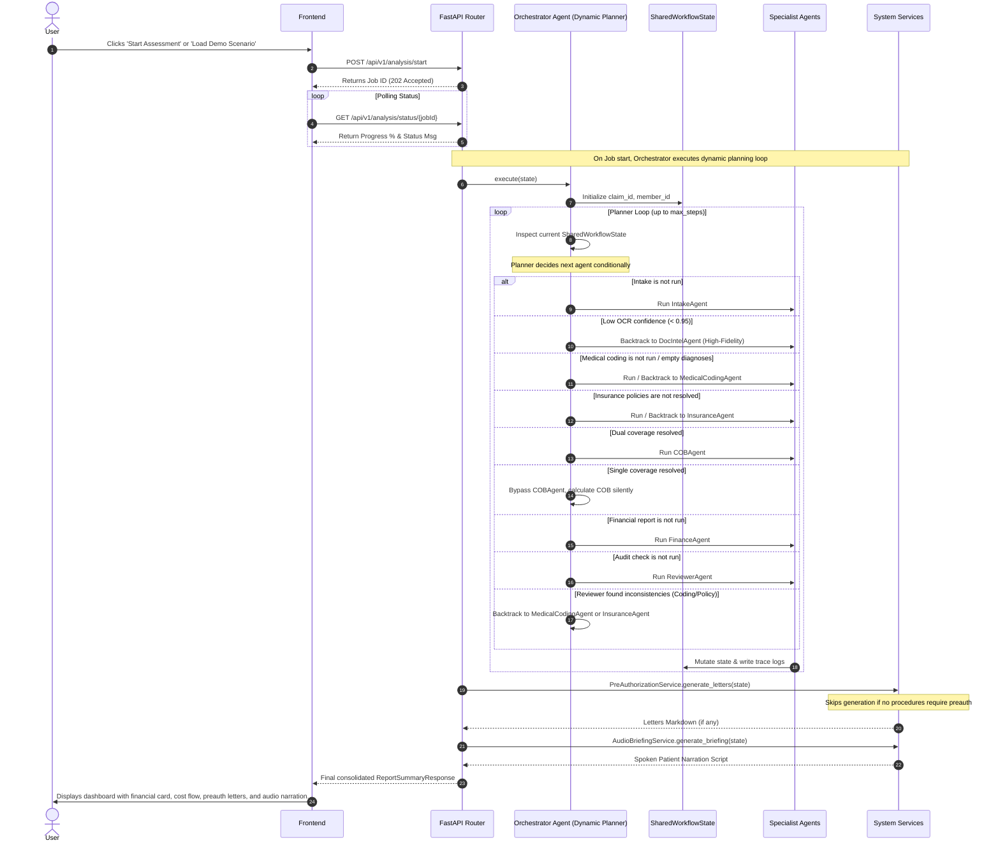

# DuCO-Agent: Dual Coverage AI Orchestrator

DuCO-Agent is a high-fidelity, multi-agent AI system designed to coordinate medical benefits for families with dual insurance coverage. The application parses clinical documentation (PDFs, images, and text), resolves primary and secondary insurance policies, determines exact coverage and coinsurance calculations, drafts prior-authorization letters, and generates spoken patient-narrative briefings.

---

## 1. Architectural Overview

DuCO-Agent is designed around a **clean separation of concerns**:
*   **Dynamic Agentic Planner**: Instead of a predefined static sequence, the orchestrator acts as a dynamic planner that inspects the live `SharedWorkflowState` and conditionally routes/backtracks to different specialist agents.
*   **Specialist Agents (Orchestration)**: Typed asynchronous Python agents handle execution, validation, audits, and trace logging under the planner's direction. Gemini is used only for OCR/coding/reviewer inference when explicitly configured.
*   **Core Services (Business Logic)**: Standalone Python engines implement COB order, CPT coverage, medical-necessity checks, per-member deductible/OOP accumulators, INR rounding, and financial conservation checks. LLM output never supplies payment calculations.
*   **Shared Workflow State**: A unified transaction registry (`SharedWorkflowState`) that tracks variables and accumulates parsed results as the pipeline moves from Intake to Final Review.

### System Architecture Diagram

```mermaid
graph TD
    subgraph Frontend [React Frontend - Vite]
        UI[Results & Intake Dashboard] --> API[ApiService - Axios]
    end
    
    subgraph Backend [FastAPI Backend]
        API --> Routes[FastAPI Router - api/v1]
        Routes --> Orchestrator[Orchestrator Agent]
        
        subgraph Multi-Agent System [Orchestrated Specialist Agents]
            Orchestrator --> IntakeAgent[Intake Agent]
            Orchestrator --> DocIntelAgent[Doc Intel Agent]
            Orchestrator --> MedicalCodingAgent[Medical Coding Agent]
            Orchestrator --> InsuranceAgent[Insurance Agent]
            Orchestrator --> COBAgent[COB Agent]
            Orchestrator --> FinanceAgent[Finance Agent]
            Orchestrator --> ReviewerAgent[Reviewer Agent]
        end
        
        subgraph Services [System Services & Engines]
            DocIntelAgent --> DocIntelServ[DocumentIntelligenceService]
            MedicalCodingAgent --> MedCodingServ[MedicalCodingService]
            InsuranceAgent --> InsServ[InsuranceService]
            COBAgent --> COBEng[COBEngine]
            FinanceAgent --> FinEng[FinanceEngine]
            Orchestrator --> PreauthServ[PreAuthorizationService]
            Orchestrator --> AudioServ[AudioBriefingService]
        end
        
        SharedState[(SharedWorkflowState)] <--> Multi-Agent System
        LocalStorage[(Local File Storage)] <--> DocIntelServ
    end
```

---

## 2. Dynamic Planning & Conditional Routing

Rather than coordinating agents in a rigid linear sequence, DuCO-Agent uses a **dynamic, state-inspecting planner** to coordinate specialist execution. The planner evaluates the live `SharedWorkflowState` at each step and makes autonomous routing decisions:

1. **OCR Confidence Audit (Rule 1)**
   - If `DocIntelAgent` finishes but any parsed document yields a confidence score `< 0.95`, the planner discards downstream progress, clears the document cache, activates the `"high_fidelity"` strategy in `ocr_strategies`, and routes execution back to `DocIntelAgent`.
2. **Missing Diagnosis Correction / Clarification (Rule 2)**
   - If `MedicalCodingAgent` extracts no ICD-10 diagnoses:
     - On the first attempt, the planner automatically triggers a self-correcting retry loop back to `MedicalCodingAgent` with active warnings.
     - If no diagnoses are resolved after the retry, the planner halts the pipeline, bypasses all insurance/financial agents, flags `state.requires_human_approval = True`, and updates the status to request human clarification.
3. **COBAgent Bypass for Single Coverage (Rule 3)**
   - If the patient only holds one active insurance policy, the planner dynamically bypasses the execution of `COBAgent` in the trace, executing the benefit calculations via the `COBEngine` silently to construct the required `cob_decision` for the financial ledger without running the separate specialist step.
4. **Prior Authorization Letter Minimization (Rule 4)**
   - The system checks if any extracted CPT procedure requires pre-authorization under the mapped policies. If no procedure requires pre-authorization, the `PreAuthorizationService` skips letter generation entirely, returning an empty set of request documents.
5. **Reviewer Quality Backtracking & Audit Corrections (Rule 5)**
   - During the final audit phase, `ReviewerAgent` flags logical inconsistencies (e.g. name mismatches between insurers or policy subscribers and medical records, uncovered procedure codes, or missing diagnoses).
   - The planner inspects these warnings:
     - **Coding/clinical inconsistencies** trigger backtracking loops back to `MedicalCodingAgent` (up to 2 runs).
     - **Insurance/policy resolution inconsistencies** trigger backtracking loops back to `InsuranceAgent` (up to 2 runs).

---

## 3. Agent Responsibilities

The Multi-Agent framework orchestrates seven specialist agents:

| Agent | Icon | Core Responsibility |
| :--- | :---: | :--- |
| **Intake Agent** | 📥 | Validates uploaded files, verifies patient details, and initializes the workflow transaction. |
| **Doc Intel Agent** | 🔍 | Directs PDF parsing and Gemini Vision OCR extraction based on the uploaded file format. |
| **Medical Coding Agent** | 🏷️ | Analyzes clinical texts to infer ICD-10 diagnosis codes and CPT procedure codes using Gemini. |
| **Insurance Agent** | 🛡️ | Loads and resolves active policy details, matching group numbers and subscriber data. |
| **COB Agent** | 🔀 | Applies insurance coordination guidelines (e.g. Birthday Rule, subscriber-first) to set claim payment order. |
| **Finance Agent** | 💵 | Calculates exact payment allocations, deductible applications, coinsurance, and out-of-pocket maximum limits. |
| **Reviewer Agent** | ⚖️ | Audits the final state, flagging name mismatches, low coding confidence, or missing authorization drafts. |

---

## 4. Technology Stack

*   **Frontend**: React (v19), TypeScript, TailwindCSS (v4), React Router, Axios, and Vite.
*   **Backend**: Python (v3.10), FastAPI, Pydantic (Type validation), PyPDF (PDF metadata & parsing).
*   **AI & Reasoning**: Google Gemini 2.5 Flash via structured JSON schemas for optional OCR, coding inference, and reviewer assistance.

---

## 5. Folder Structure

```text
duco-agent-ai-assessment/
│
├── frontend/                   # React TypeScript Web Application
│   ├── src/
│   │   ├── components/         # Reusable layouts, visual timeline, SVG visualizer
│   │   ├── pages/              # Intake Workspace and Results dashboard pages
│   │   ├── services/           # ApiService axios connector
│   │   └── types/              # Frontend TypeScript definitions
│   ├── package.json            # Scripts (dev, build, lint, preview)
│   └── vite.config.ts          # Vite configuration
│
├── backend/                    # FastAPI python microservice
│   ├── agents/                 # Python ADK-based specialist agents definitions
│   ├── app/
│   │   ├── api/v1/endpoints/   # Intake, analysis, and report routers
│   │   ├── core/               # Google ADK base classes (Agent, SharedWorkflowState)
│   │   ├── dependencies/       # Dependency Injection hooks
│   │   └── schemas/            # Request/Response Pydantic validation schemas
│   ├── mock_data/              # Policy rules for BlueShield and UnitedHealth
│   ├── services/               # Core algorithms (COB, Finance, Audio Briefing, Doc-Intel)
│   ├── tests/                  # Pytest suite
│   ├── requirements.txt        # Backend dependencies
│   └── main.py                 # FastAPI server startup entrypoint
│
└── README.md                   # Main system documentation
```

---

## 6. End-to-End Workflow Sequence



---

## 7. Setup & Execution Instructions

### Prerequisites
*   Node.js (v18+)
*   Python (v3.10+)

### Backend Server Setup
1.  Navigate to the backend directory:
    ```bash
    cd backend
    ```
2.  Create and activate a python virtual environment:
    ```bash
    # Windows
    python -m venv .venv
    .venv\Scripts\activate

    # macOS / Linux
    python3 -m venv .venv
    source .venv/bin/activate
    ```
3.  Install standard packages:
    ```bash
    pip install -r requirements.txt
    ```
4.  *(Optional)* Set the Gemini API key for inference when a document does not explicitly contain clinical codes. Without a key, explicit codes are processed deterministically and inference-only inputs fail closed; mock substitution is available only through the explicitly selected Demo mode:
    ```bash
    # Windows Powershell
    $env:GEMINI_API_KEY="your-api-key"

    # macOS / Linux / Bash
    export GEMINI_API_KEY="your-api-key"
    ```
5.  Start the FastAPI application:
    ```bash
    python main.py
    ```
    The API runs at `http://localhost:8000`.

### Frontend Web App Setup
1.  Navigate to the frontend directory:
    ```bash
    cd ../frontend
    ```
2.  Install packages:
    ```bash
    npm install
    ```
3.  Start the development server:
    ```bash
    npm run dev
    ```
    Open `http://localhost:5173` in your browser.

---

## 8. Assumptions & General Limitations

### Assumptions
*   **Dual Policies**: The customer coordinates between exactly two plans (BlueShield Cross and UnitedHealth).
*   **Birthday Rule**: Claims for dependents (e.g. Aarav Sen) prioritize the primary insurer based on whichever parent's birthday falls earlier in the calendar year.
*   **Pace**: Conversational reading pace is estimated at 140 WPM to compute narration durations.

### Grounding and safety behavior
*   **Patient-specific claims**: Documents are grouped by resolved patient identity. Priya's services and Aarav's services are adjudicated as separate claims with their own payer order and accumulators, then aggregated for the family dashboard.
*   **No invented prices**: Claim lines must carry an amount extracted from a source document. Total-only invoices may use a labeled deterministic allocation that forces clinician approval; otherwise the workflow stops instead of using a fixed CPT price.
*   **Scanned documents**: Image and scanned-PDF OCR support both RapidOCR and Gemini Vision. Real PNG/PDF fixtures and local OCR integration tests are included under `backend/sample_inputs`.
*   **Approval gate**: Reports, PDFs, and downloadable audio remain unavailable while reviewer findings await clinician approval. Rejection preserves the existing evidence, trace, and feedback for the correction pass.
*   **Artifacts**: Prior-authorization letters are clinician-review drafts containing only procedures requiring authorization for that patient and plan. Missing provider fields remain visibly incomplete rather than being fabricated.
*   **Audio**: The browser can read the grounded narration through the Web Speech API. MP3 generation fails explicitly if the configured speech service is unavailable; it never returns fake silence.

### Verification

```bash
cd backend
python -m pytest -q

cd ../frontend
npx tsc -b --noEmit
npm run lint
```

---

## 9. Future Improvements

*   **Text-to-Speech (TTS) Streaming**: Integrate Google Cloud Text-to-Speech to dynamically stream generated patient audio briefings directly from the frontend.
*   **Database Persistence**: Move from an in-memory job database to PostgreSQL for persistent historical claims auditing.
*   **User Policy Customizer**: Allow clinics to dynamically upload new insurer policy rules (JSON format) directly from the UI.
