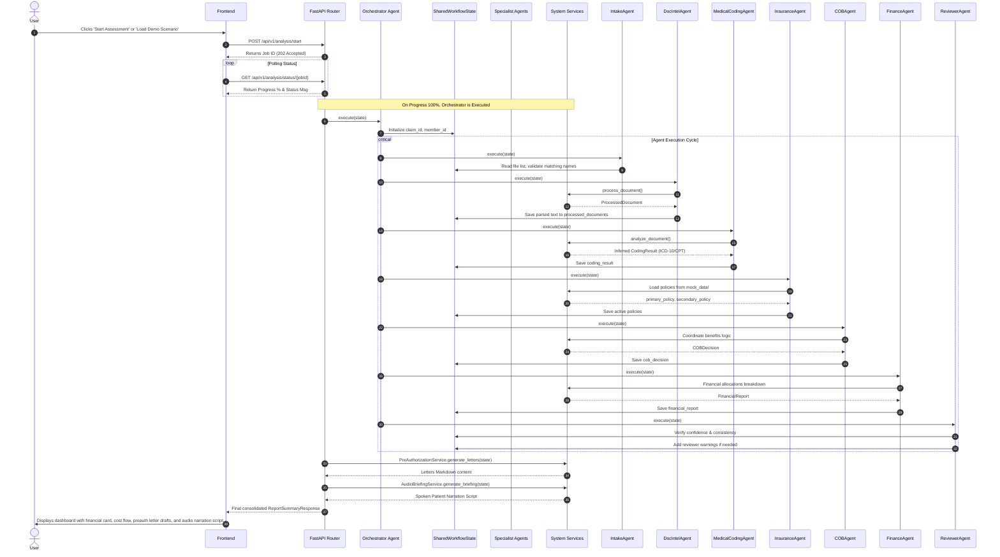

# DuCO-Agent: Dual Coverage AI Orchestrator

DuCO-Agent is a high-fidelity, multi-agent AI system designed to coordinate medical benefits for families with dual insurance coverage. The application parses clinical documentation (PDFs, images, and text), resolves primary and secondary insurance policies, determines exact coverage and coinsurance calculations, drafts prior-authorization letters, and generates spoken patient-narrative briefings.

---

## 1. Architectural Overview

DuCO-Agent is designed around a **clean separation of concerns**:
*   **Specialist Agents (Orchestration)**: Powered by the Google ADK and Gemini, these agents handle execution sequencing, input validation, audits, and pipeline logging.
*   **Core Services (Business Logic)**: Standalone Python engines that implement strict healthcare rules (COB coordination order, CPT coverage checks, deductible accounting, and financial ledger breakdowns). Agents invoke these services but do not embed business rules inside their LLM prompts, ensuring reliable and auditable calculations.
*   **Shared Workflow State**: A unified transaction registry (`SharedWorkflowState`) that tracks variables and accumulates parsed results as the pipeline moves from Intake to Final Review.

### System Architecture Diagram

```mermaid
graph TD
    subgraph Frontend [React Frontend - Vite]
        UI[Results & Intake Dashboard] --> API[ApiService - Axios]
    end
    
    subgraph Backend [FastAPI Backend]
        API --> Routes[FastAPI Router - api/v1]
        Routes --> Orchestrator[Orchestrator Agent]
        
        subgraph Multi-Agent System [Orchestrated Specialist Agents]
            Orchestrator --> IntakeAgent[Intake Agent]
            Orchestrator --> DocIntelAgent[Doc Intel Agent]
            Orchestrator --> MedicalCodingAgent[Medical Coding Agent]
            Orchestrator --> InsuranceAgent[Insurance Agent]
            Orchestrator --> COBAgent[COB Agent]
            Orchestrator --> FinanceAgent[Finance Agent]
            Orchestrator --> ReviewerAgent[Reviewer Agent]
        end
        
        subgraph Services [System Services & Engines]
            DocIntelAgent --> DocIntelServ[DocumentIntelligenceService]
            MedicalCodingAgent --> MedCodingServ[MedicalCodingService]
            InsuranceAgent --> InsServ[InsuranceService]
            COBAgent --> COBEng[COBEngine]
            FinanceAgent --> FinEng[FinanceEngine]
            Orchestrator --> PreauthServ[PreAuthorizationService]
            Orchestrator --> AudioServ[AudioBriefingService]
        end
        
        SharedState[(SharedWorkflowState)] <--> Multi-Agent System
        LocalStorage[(Local File Storage)] <--> DocIntelServ
    end
```

---

## 2. Agent Responsibilities

The Multi-Agent framework orchestrates seven specialist agents:

| Agent | Icon | Core Responsibility |
| :--- | :---: | :--- |
| **Intake Agent** | 📥 | Validates uploaded files, verifies patient details, and initializes the workflow transaction. |
| **Doc Intel Agent** | 🔍 | Directs PDF parsing and Gemini Vision OCR extraction based on the uploaded file format. |
| **Medical Coding Agent** | 🏷️ | Analyzes clinical texts to infer ICD-10 diagnosis codes and CPT procedure codes using Gemini. |
| **Insurance Agent** | 🛡️ | Loads and resolves active policy details, matching group numbers and subscriber data. |
| **COB Agent** | 🔀 | Applies insurance coordination guidelines (e.g. Birthday Rule, subscriber-first) to set claim payment order. |
| **Finance Agent** | 💵 | Calculates exact payment allocations, deductible applications, coinsurance, and out-of-pocket maximum limits. |
| **Reviewer Agent** | ⚖️ | Audits the final state, flagging name mismatches, low coding confidence, or missing authorization drafts. |

---

## 3. Technology Stack

*   **Frontend**: React (v19), TypeScript, TailwindCSS (v4), React Router, Axios, and Vite.
*   **Backend**: Python (v3.10), FastAPI, Pydantic (Type validation), PyPDF (PDF metadata & parsing).
*   **AI & Reasoning**: Google Generative AI (Gemini 1.5 Flash) via structured JSON schema instructions.

---

## 4. Folder Structure

```text
duco-agent-ai-assessment/
│
├── frontend/                   # React TypeScript Web Application
│   ├── src/
│   │   ├── components/         # Reusable layouts, visual timeline, SVG visualizer
│   │   ├── pages/              # Intake Workspace and Results dashboard pages
│   │   ├── services/           # ApiService axios connector
│   │   └── types/              # Frontend TypeScript definitions
│   ├── package.json            # Scripts (dev, build, lint, preview)
│   └── vite.config.ts          # Vite configuration
│
├── backend/                    # FastAPI python microservice
│   ├── agents/                 # Python ADK-based specialist agents definitions
│   ├── app/
│   │   ├── api/v1/endpoints/   # Intake, analysis, and report routers
│   │   ├── core/               # Google ADK base classes (Agent, SharedWorkflowState)
│   │   ├── dependencies/       # Dependency Injection hooks
│   │   └── schemas/            # Request/Response Pydantic validation schemas
│   ├── mock_data/              # Policy rules for BlueShield and UnitedHealth
│   ├── services/               # Core algorithms (COB, Finance, Audio Briefing, Doc-Intel)
│   ├── tests/                  # Pytest suite
│   ├── requirements.txt        # Backend dependencies
│   └── main.py                 # FastAPI server startup entrypoint
│
└── README.md                   # Main system documentation
```

---

## 5. End-to-End Workflow Sequence



---

## 6. Setup & Execution Instructions

### Prerequisites
*   Node.js (v18+)
*   Python (v3.10+)

### Backend Server Setup
1.  Navigate to the backend directory:
    ```bash
    cd backend
    ```
2.  Create and activate a python virtual environment:
    ```bash
    # Windows
    python -m venv .venv
    .venv\Scripts\activate

    # macOS / Linux
    python3 -m venv .venv
    source .venv/bin/activate
    ```
3.  Install standard packages:
    ```bash
    pip install -r requirements.txt
    ```
4.  *(Optional)* Set the Gemini API key environment variable for live LLM extractions. If omitted, the system activates local high-fidelity simulated parsing rules:
    ```bash
    # Windows Powershell
    $env:GEMINI_API_KEY="your-api-key"

    # macOS / Linux / Bash
    export GEMINI_API_KEY="your-api-key"
    ```
5.  Start the FastAPI application:
    ```bash
    python main.py
    ```
    The API runs at `http://localhost:8000`.

### Frontend Web App Setup
1.  Navigate to the frontend directory:
    ```bash
    cd ../frontend
    ```
2.  Install packages:
    ```bash
    npm install
    ```
3.  Start the development server:
    ```bash
    npm run dev
    ```
    Open `http://localhost:5173` in your browser.

---

## 7. Assumptions & General Limitations

### Assumptions
*   **Dual Policies**: The customer coordinates between exactly two plans (BlueShield Cross and UnitedHealth).
*   **Birthday Rule**: Claims for dependents (e.g. Aarav Sen) prioritize the primary insurer based on whichever parent's birthday falls earlier in the calendar year.
*   **Pace**: Conversational reading pace is estimated at 140 WPM to compute narration durations.

### Limitations
*   **Scanned PDFs**: If a PDF document does not contain extractable text characters, the system defaults to Gemini Vision API OCR. Without aconfigured API Key, it uses the assessment mock texts.
*   **TTS Integration**: The Patient Audio Briefing generates structured text sections optimized for text-to-speech engine ingestion. Synthetic audio files are represented by a mockup player card.

---

## 8. Future Improvements

*   **Text-to-Speech (TTS) Streaming**: Integrate Google Cloud Text-to-Speech to dynamically stream generated patient audio briefings directly from the frontend.
*   **Database Persistence**: Move from an in-memory job database to PostgreSQL for persistent historical claims auditing.
*   **User Policy Customizer**: Allow clinics to dynamically upload new insurer policy rules (JSON format) directly from the UI.
