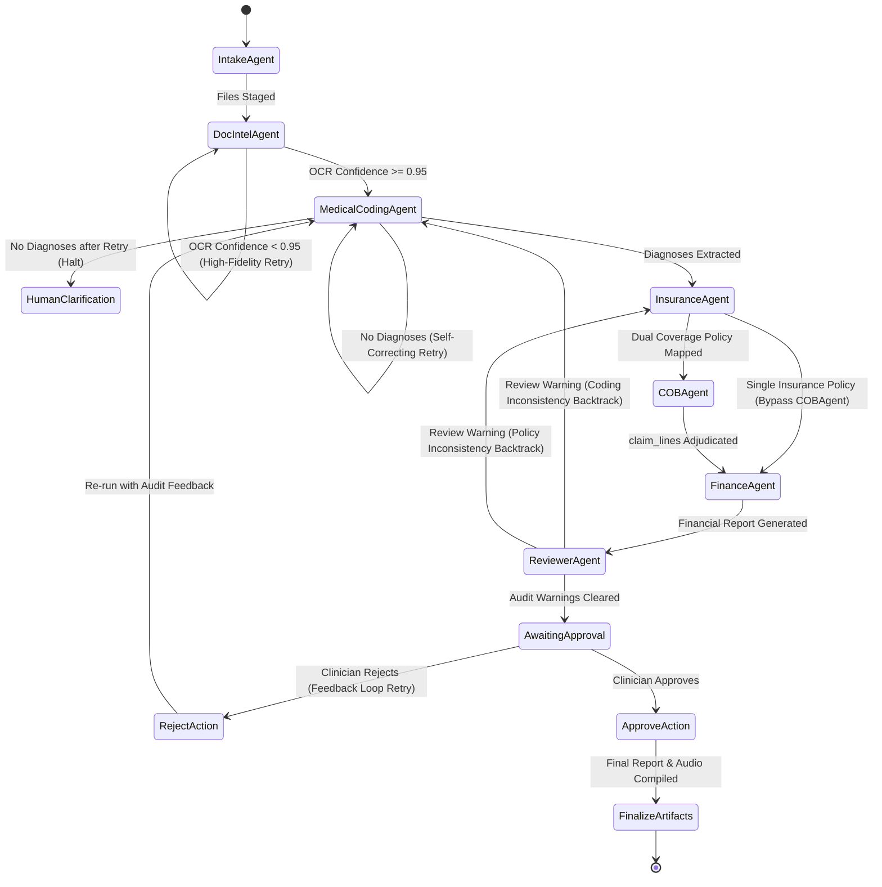

# 🛡️ DuCO-Agent: Dual Coverage AI Orchestrator

DuCO-Agent is a high-fidelity, multi-agent AI system designed to coordinate medical benefits for families with dual insurance coverage. The application parses clinical documentation (PDFs, images, and text), resolves primary and secondary insurance policies, determines exact coverage and coinsurance calculations, drafts prior-authorization letters, and generates spoken patient-narrative briefings.

---

## 🗺️ System Architecture

The codebase follows a strict separation of concerns, dividing execution between a React/TypeScript frontend and a FastAPI backend powered by specialized AI agents and deterministic calculation engines.

```mermaid
graph TD
    subgraph Frontend [React Web Application]
        UI[Results & Intake Dashboard] --> API[ApiService - Axios]
    end
    
    subgraph Backend [FastAPI Backend Server]
        API --> Routes[FastAPI Router - api/v1]
        Routes --> Orchestrator[Orchestrator Agent]
        
        subgraph Multi-Agent System [Orchestrated Specialist Agents]
            Orchestrator --> IntakeAgent[Intake Agent]
            Orchestrator --> DocIntelAgent[Doc Intel Agent]
            Orchestrator --> MedicalCodingAgent[Medical Coding Agent]
            Orchestrator --> InsuranceAgent[Insurance Agent]
            Orchestrator --> COBAgent[COB Agent]
            Orchestrator --> FinanceAgent[Finance Agent]
            Orchestrator --> ReviewerAgent[Reviewer Agent]
        end
        
        subgraph Services [System Services & Engines]
            DocIntelAgent --> DocIntelServ[DocumentIntelligenceService]
            MedicalCodingAgent --> MedCodingServ[MedicalCodingService]
            InsuranceAgent --> InsServ[InsuranceService]
            COBAgent --> COBEng[COBEngine]
            FinanceAgent --> FinEng[FinanceEngine]
            Orchestrator --> PreauthServ[PreAuthorizationService]
            Orchestrator --> AudioServ[AudioBriefingService]
        end
        
        SharedState[(SharedWorkflowState)] <--> Multi-Agent System
        LocalStorage[(Local File Storage)] <--> DocIntelServ
    end
```

---

## 🧠 Dynamic Control Flow & Agentic Planning

Instead of executing in a rigid, hardcoded sequential script, the pipeline is guided by a **Dynamic Orchestrator Planner** ([adk.py](file:///c:/Projects/hcl/duco-agent-ai-assessment/backend/app/core/adk.py)) that inspects the live `SharedWorkflowState` and makes routing, backtracking, self-correcting retry, or approval decisions.

### Dynamic Decision Paths



> [!IMPORTANT]
> **Clinician Approval Gate:** Results, downloadable PDFs, and audio briefs remain locked and unavailable to the user while reviewer warnings await clinician review. Approval finalizes the artifacts, whereas Rejection feeds auditor notes back into the warning state to drive a self-correction retry loop.

---

## 🤖 Specialist Agents Directory

The orchestrator utilizes seven specialist agents, each holding a distinct boundary of responsibility:

| Agent | Icon | File Location | Core Responsibility |
| :--- | :---: | :--- | :--- |
| **Intake Agent** | 📥 | [`intake.py`](file:///c:/Projects/hcl/duco-agent-ai-assessment/backend/agents/intake.py) | Validates staging folders and checks that all uploaded files are present in the transaction slot. |
| **Doc Intel Agent** | 🔍 | [`document_intelligence.py`](file:///c:/Projects/hcl/duco-agent-ai-assessment/backend/agents/document_intelligence.py) | Directs PDF parsing and Gemini Vision OCR/RapidOCR extraction based on document formats. |
| **Medical Coding Agent** | 🏷️ | [`medical_coding.py`](file:///c:/Projects/hcl/duco-agent-ai-assessment/backend/agents/medical_coding.py) | Extracts and deduplicates CPT procedure and ICD-10 diagnosis codes from texts using Gemini with reflection prompts. |
| **Insurance Agent** | 🛡️ | [`insurance.py`](file:///c:/Projects/hcl/duco-agent-ai-assessment/backend/agents/insurance.py) | Maps active insurance policy details, subscriber roles, and individual/family coverage limits. |
| **COB Agent** | 🔀 | [`cob.py`](file:///c:/Projects/hcl/duco-agent-ai-assessment/backend/agents/cob.py) | Evaluates insurer payment orders (e.g., Birthday Rule) and initiates coordinate benefits adjudication. |
| **Finance Agent** | 💵 | [`finance.py`](file:///c:/Projects/hcl/duco-agent-ai-assessment/backend/agents/finance.py) | Translates raw COB decisions into audited ledger breakdowns and out-of-pocket splits. |
| **Reviewer Agent** | ⚖️ | [`reviewer.py`](file:///c:/Projects/hcl/duco-agent-ai-assessment/backend/agents/reviewer.py) | Audits consistency between clinical findings, names across insurers, and covers, logging warnings. |

---

## ⚙️ Core Engines & Services

All healthcare rules, document extraction heuristics, and financial ledgers are evaluated by **deterministic python algorithms**—never delegated to LLM hallucination.

*   **[`cob_engine.py`](file:///c:/Projects/hcl/duco-agent-ai-assessment/backend/services/cob_engine.py)**: Evaluates coordination guidelines (Subscriber-First, Birthday Rule, Stable Sorting Fallback) and performs line-by-line copay, deductible satisfaction, and coinsurance rate splitting.
*   **[`finance_engine.py`](file:///c:/Projects/hcl/duco-agent-ai-assessment/backend/services/finance_engine.py)**: Performs Decimal arithmetic calculations to split out-of-pocket patient costs. Enforces conservation of funds:
    $$\text{Billed Amount} = \text{Primary Paid} + \text{Secondary Paid} + \text{Patient Responsibility} + \text{Contractual Writeoff}$$
*   **[`document_facts.py`](file:///c:/Projects/hcl/duco-agent-ai-assessment/backend/services/document_facts.py)**: Deterministically extracts patient name, member ID, dates of birth, and cpt/invoiced amounts from OCR texts.
*   **[`preauth.py`](file:///c:/Projects/hcl/duco-agent-ai-assessment/backend/services/preauth.py)**: Selects procedure CPT lines requiring pre-authorization and drafts structured markdown requests.
*   **[`audio.py`](file:///c:/Projects/hcl/duco-agent-ai-assessment/backend/services/audio.py)**: Structures clear, patient-friendly spoken summaries broken into Greeting, Insurance, Financials, and Pre-Auth sections.

---

## 📂 Project Organization

```text
duco-agent-ai-assessment/
│
├── frontend/                   # React Vite Web Application
│   ├── src/
│   │   ├── components/         # Reusable layouts, visual timeline, SVG visualizer
│   │   ├── pages/              # Intake Workspace and Results pages
│   │   │   └── Results/
│   │   │       └── ResultsPage.tsx # Core results visualization
│   │   └── services/           # ApiService Axios connector
│   ├── package.json            # Vite scripts (dev, build, lint)
│   └── vite.config.ts          # Vite configuration
│
├── backend/                    # FastAPI python microservice
│   ├── agents/                 # Python ADK-based specialist agents
│   ├── app/
│   │   ├── api/v1/endpoints/   # Route handlers (Intake, Analysis, Reports)
│   │   │   ├── analysis.py     # Background orchestrator execution
│   │   │   └── reports.py      # PDF / EOB / Audio generation endpoints
│   │   └── core/
│   │       └── adk.py          # Core orchestrator and SharedWorkflowState
│   ├── mock_data/              # Policy rules for BlueShield and UnitedHealth
│   ├── sample_inputs/          # Committed scans, estimates, and PDFs
│   ├── services/               # Core business algorithms (COB, Finance, Audio, Doc-Intel)
│   ├── tools/                  # Agent actions (Medical Coding, OCR, Insurer Lookup)
│   └── tests/                  # Pytest test suite
│
└── README.md                   # Main documentation guide
```

---

## 🚀 Setup & Execution Guide

### Prerequisites
*   Node.js (v18+)
*   Python (v3.10+)

### 1. Backend Server Setup
1.  Navigate to the backend directory:
    ```bash
    cd backend
    ```
2.  Create and activate a python virtual environment:
    ```bash
    # Windows Powershell
    python -m venv .venv
    .venv\Scripts\activate

    # macOS / Linux / Bash
    python3 -m venv .venv
    source .venv/bin/activate
    ```
3.  Install standard packages:
    ```bash
    pip install -r requirements.txt
    ```
4.  *(Optional)* Set the Gemini API key to enable LLM-based clinical-code inference and reviewer audits. (Without a key, explicit document facts are parsed deterministically; inference-only scenarios fail closed):
    ```bash
    # Windows Powershell
    $env:GEMINI_API_KEY="your-api-key"

    # macOS / Linux / Bash
    export GEMINI_API_KEY="your-api-key"
    ```
5.  Start the FastAPI application:
    ```bash
    python main.py
    ```
    The server runs at `http://127.0.0.1:8000`.

### 2. Frontend Web App Setup
1.  Navigate to the frontend directory:
    ```bash
    cd ../frontend
    ```
2.  Install dependencies:
    ```bash
    npm install
    ```
3.  Start the dev server:
    ```bash
    npm run dev
    ```
    Open `http://localhost:5173` in your browser.

---

## 🧪 Verification & Tests

A comprehensive suite of 70 tests covers the mathematical engines, coordination order rules, document intelligence text extractors, pre-authorization letter compilers, and audio narrations.

```bash
# Run backend pytest suite
cd backend
.venv\Scripts\python -m pytest

# Run frontend linting & typescript build checks
cd ../frontend
npx tsc -b --noEmit
npm run lint
```

---

## 📜 Compliance & Safety Rules

To ensure clinical soundness and medical safety, the system enforces the following constraints:
1.  **Birthday Rule Order**: For dependent children, the primary policy is resolved based on the parent whose birthday falls earliest in the calendar year. Subscriber roles take absolute precedence over dependent roles.
2.  **Separate Letters per Patient**: Claim lines for different family members (e.g., Aarav and Priya) are processed as separate claims and generate separate pre-authorization request letters. Combining family members in a single request is blocked to avoid administrative confusion.
3.  **No Hallucinated Data**: Prior-authorization letters draft placeholders for missing provider names, facility details, or NPIs, clearly marking them as `"Not documented - clinician completion required"` rather than inventing fields.
4.  **Audio Availability**: Estimated reading duration section segments are compiled at 140 WPM. The audio briefing endpoint fails explicitly (returning HTTP 503) if the Text-to-Speech API is down, prompting the user to read the text rather than providing a silent audio stream.
